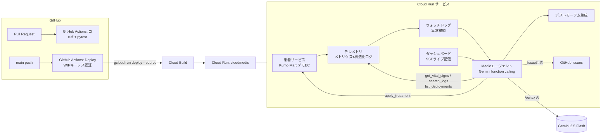

# CloudMedic 🩺

**Cloud Run上のサービスを自律的に「診察・処置」し、ポストモーテムまで書くSREエージェント**

> DevOps × AI Agent Hackathon 2026 提出作品


## 🚑 何をするプロダクトか

深夜にアラートが鳴る。ログを漁り、直近のデプロイを疑い、ロールバックを判断し、
朝会のためにポストモーテムを書く——オンコール対応はエンジニアの睡眠と創造性を削り続けてきました。

**CloudMedic** は、この一連の障害対応を医師の診察のように自律実行するAIエージェントです。

1. **検知** — ウォッチドッグがバイタル（エラー率・p95レイテンシ・メモリ）の異常を検知
2. **診察** — Gemini がバイタル確認 → ログ調査 → デプロイ履歴確認を自ら計画して実行
3. **処置** — 原因に応じてロールバック / 再起動 / スケールアウト / フェイルセーフ切替を選択
4. **回復確認** — 処置後のトラフィックを観測し、回復しなければ別の処置を再検討
5. **カルテ作成** — ポストモーテムを自動生成し、再発防止タスクをGitHub Issueとして起票

処置の前に人間の承認を求める「**承認モード**」と全自動の「**自動対応モード**」を切替でき、
実運用への段階的な導入（まず承認モードで信頼を築き、その後自動化）を想定した設計です。

## 🎬 デモ

デプロイURL: **https://cloudmedic-mzbfpd2olq-an.a.run.app**

ダッシュボードの「💉 障害を注入」から4種類の障害（エラーストーム / レイテンシ悪化 /
メモリリーク / 不良デプロイ）を発生させると、エージェントの思考と対応がリアルタイムで
流れる様子を体験できます。

## 🏗 アーキテクチャ



### エージェントのツール（function calling）

| ツール | 役割 |
|---|---|
| `get_vital_signs` | エラー率・p95レイテンシ・メモリ等の取得 |
| `search_logs` | 直近ログの検索（障害シグネチャの特定） |
| `list_deployments` | デプロイ履歴の確認（デプロイ起因の切り分け） |
| `apply_treatment` | 処置の実行（承認モードでは人間の承認を待機） |
| `verify_recovery` | 処置後の回復確認 |
| `write_postmortem` | ポストモーテムの自動生成 |
| `create_github_issue` | 再発防止タスクの起票 |

LLMが利用できない状況（APIクォータ枯渇など）では、同一のツール群で動く決定的な
フォールバックエンジンに自動で切り替わります（CIのテストもこれで実行）。

## ⚙️ ハッカソン技術要件との対応

| 要件 | 使用技術 |
|---|---|
| GCPアプリケーション実行プロダクト（必須） | **Cloud Run**（min-instances=1、GitHub ActionsからCloud Build経由でデプロイ） |
| GCP AI技術（必須） | **Gemini API**（gemini-2.5-flash、Vertex AI経由・ADC認証） |
| DevOps「まわす」 | GitHub Actions CI/CD、Workload Identity Federationによるキーレス認証、デプロイ後スモークテスト |

## 🚀 ローカルでの実行

```bash
pip install -r requirements-dev.txt

# Gemini APIキーを使う場合
export GEMINI_API_KEY=<your-key>
# キーなしでも決定的フォールバックで動作します（CLOUDMEDIC_SCRIPTED=1 で強制）

uvicorn app.main:app --reload
# → http://localhost:8000
```

テスト・Lint:

```bash
pytest
ruff check .
```

## ☁️ デプロイ

[infra/README.md](infra/README.md) を参照してください。Cloud Shellで `infra/setup.sh` を
実行し、GitHub Secretsを3つ登録すれば、以後は main への push だけで
テスト→デプロイ→スモークテストが自動実行されます。

## 📁 構成

```
app/
  main.py          FastAPI（ダッシュボード / 患者API / インシデントAPI / SSE）
  patient.py       患者サービス「Kumo Mart」（障害注入・処置のシミュレーション）
  telemetry.py     メトリクス・構造化ログ（Cloud Logging対応）
  watchdog.py      異常検知とインシデント自動起票
  agent/
    core.py        エージェントループ（function calling）
    tools.py       ツール定義と実装（承認フロー含む）
    llm.py         Gemini / フォールバックエンジン
    prompts.py     システムプロンプト
  static/          ダッシュボード（SSEライブUI）
tests/             pytest（エージェントE2E含む）
infra/             GCPセットアップスクリプト（WIF構成）
.github/workflows/ CI・Cloud Runデプロイ
```

## 環境変数

| 変数 | 説明 |
|---|---|
| `GEMINI_API_KEY` | Gemini APIキー（ローカル開発用） |
| `GOOGLE_GENAI_USE_VERTEXAI` | `true` でVertex AI経由（Cloud Run本番はこちら） |
| `GOOGLE_CLOUD_PROJECT` / `GOOGLE_CLOUD_LOCATION` | Vertex AI利用時のプロジェクト/ロケーション |
| `GEMINI_MODEL` | 使用モデル（既定: `gemini-2.5-flash`） |
| `CLOUDMEDIC_SCRIPTED` | `1` でLLMを使わない決定的エンジンを強制（CI用） |
| `GITHUB_TOKEN` / `GITHUB_ISSUE_REPO` | 再発防止Issue起票先（任意） |

## License

MIT
